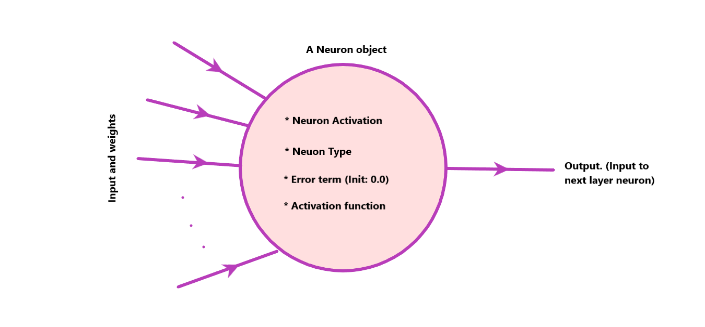
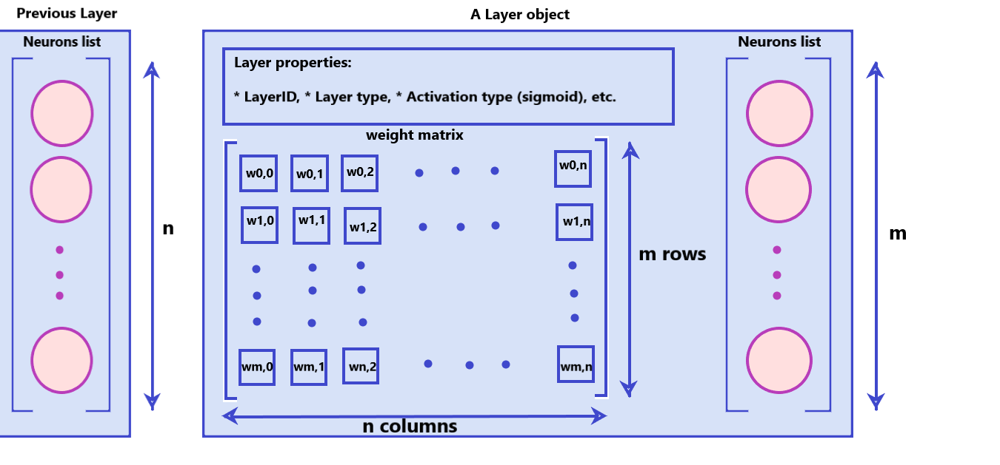
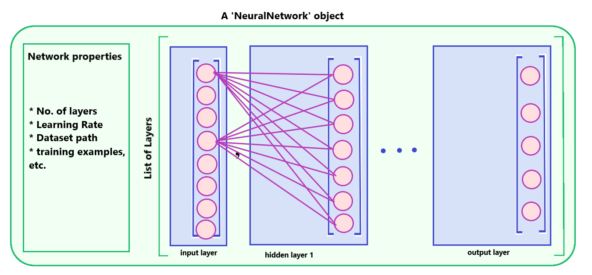
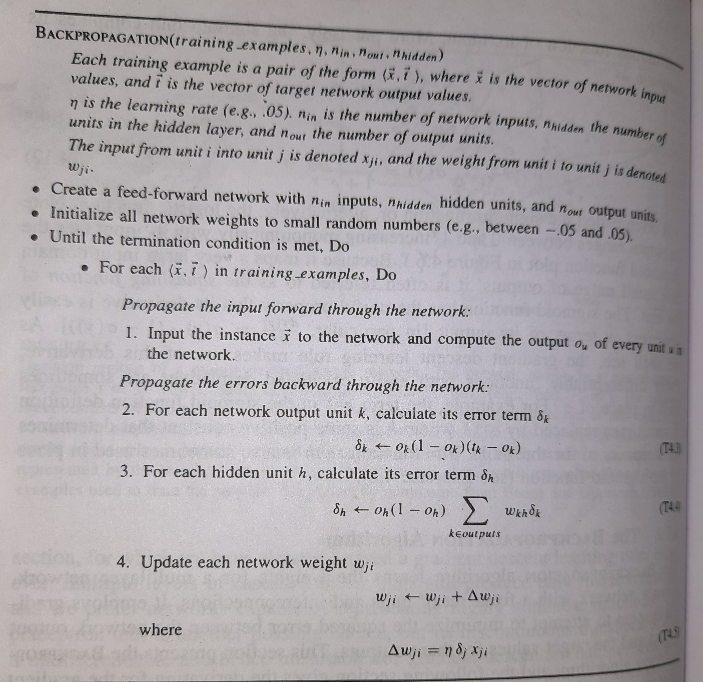
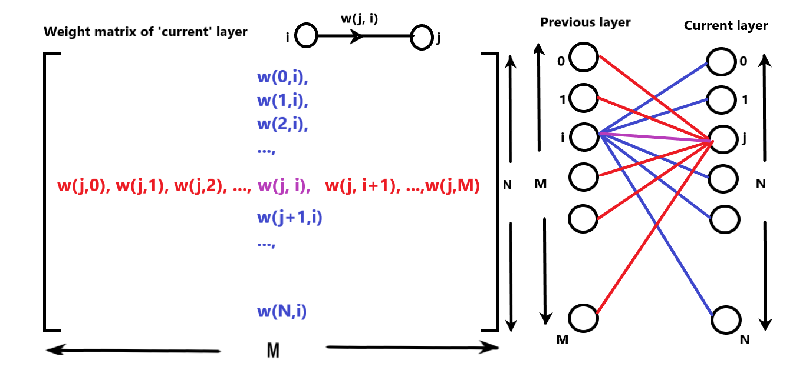

<h1 style="font-family:georgia;"> Machine Learning Assignment 2 </h1>
<h2 style="font-family:georgia;"> Implementing Back-Propagation Algorithm </h2>
<h3 style="font-family:georgia;"> Submitted by: Shashwat Kadam (BT16CSE035) </h3>

<b>Problem statement:</b> Implement a back propagation algorithm using any programming language

<h1 style='font-family:georgia; font-size:28px'> Contents</h1>
<ul style='font-family:georgia;'>
    <li>    <b>1. Structure of the program</b>
    <li>    <b>2. Data Structures</b>
        <ul>
            <li> 2.1. class Neuron
            <li> 2.2. class Layer
            <li> 2.3. class NeuralNetwork
        </ul>
    <li>    <b>3. The Algorithm </b>   
        <ul>
            <li> 3.1. The Weight Matrix
            <li> 3.2. The Forward Pass
            <li> 3.3. The Backward Pass
            <li> 3.4. The Training
        </ul>
    <li>    <b>4. How to run</b>   
</ul>    

<h1 style='font-family:georgia; font-size:28px'>1. Structure of the program</h1>

 The program is written in Python programming language. Python has numerous supporting libraries like 'NumPy', 'Pandas'm etc., which can make many mathematical operations efficient and avoid unwanted iterations.

 The program is written in such a way that, you have to make as less changes as possible to customize the neural the neural network according to your need

 You can create your own network structure in JSON format (some sample files are provided), add required no. of neurons, no. of layers, your activation function of choice, <b>anything you want in the JSON file and the Neural Network will be built and initialized according to it</b>. All you need to do is while creating the Network, just pass the file-path of the network structure JSON file.

The Code has three important modules:

<ul style='font-family:georgia;'> 
    <li> <b>BackProp.py</b>: All the algorithms, data structures, class definitions are present here </li>
    <li> <b>Runner.py</b>: A module to run the algorithm </li>
    <li> <b>activation_functions.py</b>: A module containing various different activation function definitions, e.g., sigmoid(), tanh(), relu(), etc.
</ul>

Now let's understand the Data structures and Class definitions

<h1 style='font-family:georgia; font-size:28px'> 2. Data Structures</h1>

The three important data structures created for the program are viz., 'Neuron', 'Layer', and 'NeuralNetwork'.

<h2 style='font-family:georgia; font-size: 24px'>2.1. class Neuron:</h2>

Figure 1. The Neuron object

A Neuron is the basic unit of every Network layer. It is a simple unit which is connected to all the previous layer neurons and the next layer with appropriate edge weights. It has various attributes like Activation value (value after applying activation function to the weighted sum), Activation function (function to be applied to the weighted sum of inputs and corresponding weights), error term (value of error term 'delta'), and Neuron type (Input layer neuron or other). A neuron has following methods:

<ul style='font-family:georgia;'>
    <li><b>activate_neuron(input_vector, weights, bias_value)</b>: Depending on the type of neuron (input or hidden or output) it calculates weighted sum of 'input_vector' and 'weights' (Using np.dot()) and applies the activation function e.g. sigmoid() to the result. The final result is stored in Neuron's 'activation' attribute.</li>
    <li><b>Setters and Getters</b></li>
</ul>

<h2 style='font-family:georgia; font-size: 24px'>2.2. class Layer:</h2>

Figure 2. The Layer object

A 'Layer' object is a collection of 'Neuron' objects, weight matrix between current layer and 'previous' layer, and various static layer attributes. Following are the 'Layer' attributes:

<ul style='font-family:georgia;'>
    <li><b>layer_type</b>: Type of layer. Input, Hidden or Output ('i', 'h', 'o' respectively).</li>
    <li><b>num_units</b>: No. of neurons in the layer.</li> 
    <li><b>prev_layer_neurons</b>: No. of neurons in previous layer (used to initialize weight matrix).</li>
    <li><b>neurons</b>: List of Neurons for this layer </li>
    <li><b>weight_matrix</b>: The weight matrix between current layer object and previous layer object.
    <li>Other static attributes like <b>layer_ID</b>, etc.</li> 
</ul>

A layer has crucial auxilliary functions which are useful in forward and backward propagation. Following are some important layer methods:

<ul style='font-family:georgia;'>
    <li><b>get_neuron_activations()</b>: Returns a 1D numpy vector with all the activation values of the neurons.</li>
    <li><b>get_neuron_error_terms()</b>: Returns a 1D numpy vector with all the error term values of the neurons.</li>
    <li><b>get_weights_for_neuron(index)</b>: Gives a vector of weights connected to the particular neuron at position 'index' in the list of neurons.</li>
    <li><b>calculate_error_terms(is_output, resource)</b>: Calculate and set the values of error term for every neuron in the layer (depending the value of 'is_output').If 'is_output' = True then calculate according to output layer otherwise calculate according to hidden layer. 'resource' is the packet containing data which will be used to calculate the error term values.</li>
    <li><b>update_weights(X, DELTA, learning_rate)</b>: Updates the weight matrix (used in backward pass). 'X' is the input vector to the layer and 'DELTA' is the vector of error terms.</li>
    <li>Other setters and getters.</li>
</ul>

<h2 style='font-family:georgia; font-size: 24px'>2.3. class NeuralNetwork:</h2>

Figure 3. The NeuralNetwork object

NeuralNetwork is the final structure consisting of the list of layers. All the training process takes place here. The network is costructed from the JSON file which is supplied while creating an instance of this class. The network in initilized by building a list of layers as per the provided configuration. Then setting the appropriate network properties. Also the the dataset is loaded during object construction from the appropriate path supplied in the JSON file. All you need to do is to call the train_network() method. The methods are described as follows:

<ul style='font-family:georgia;'>
    <li><b>forward_pass(input_vector)</b>: The forward pass of the backpropagation algorithm.</li>
    <li><b>backward_pass(target_output_vector)</b>: The backward pass of the back-propagation algorithm.</li>
    <li><b>train_network()</b>: The stochastic gradient descent version of backpropagation algorithm (Referred from Machine Learning - Tom Mitchell 4th ed.)
</ul>

<h1 style='font-family:georgia; font-size:28px'>3. The Algorithm</h1>

Figure 4. The Stochastic version of BackPropagation algorithm

The photograph taken from Machine Learning by Tom M. Mitchell by McGraw Hill Publications 

<h2 style='font-family:georgia; font-size: 24px'>3.1. The weight matrix</h2>

 The weight matrix is one of the most fundamental structure in this algorithm. The notations are referred according to the original algorithm from Machine Learning by Tom Mitchell. 'W(j, i)' is the weight between neuron 'i' of previous layer and neuron 'j' of current layer and directed <b> from 'i' to 'j' </b>. Following illustration will clarify the situation. 

Figure 5. The structure of a weight matrix

Consider all the weight directions from previous layer to current layer. 
The <i>k</i>th 'row' of weight matrix represent the weight vector containing all the weights from the previous layer, connected to <i>k</i>th neuron in current layer (in Red). 
The <i>l</i>th 'column' of the weight matrix gives the vector of the weights from <i>l</i>th neuron from previous layer to all the neurons in current layer (in Blue).

<h2 style='font-family:georgia; font-size: 24px'>3.2. The Forward Pass</h2>

The forward pass is the phase of the algorithm where the input signals propagate from input layer to the output layer. At every node, appropriate activation values are calculated by doing weighted sum of inputs and correct weights, and applying the activation function to the result. At the output layer the activations are calculated and are then used to find out error.

The <b>forward_pass(input_vector)</b> method:

For all the layers in the network starting from the input layer, the activations are calculated. The input vector is applied to the input layer, and from next layer onwards, the weighted sum for every neuron is calculated. Appropriate 'row' of the weight matrix is provided. These activations are collected in a temporary vector 'temp', which is input to the next layer. And this process continues until the last layer.

<h2 style='font-family:georgia; font-size: 24px'>3.3. The Backward Pass</h2>

After the forward pass, the error is calculated at the output layer. The layer just before 'this' layer is resposible for the error at 'this' layer. Therefore the error is distributed to all the neurons in the previous layer accordingly. Thus the error for the previous layer is calculated. But this error is due to the layer before it. In this way the error signals are propagated from the output layer to the input layer in the backward order.

The <b>backward_pass(target_output_vector)</b> method:

For all the layers starting from the output layer to the input layer, the error terms are calculated first according to the formulae in the algorithm. After all the error terms are calculated, the weight matrices for all the layers are updated. (Read the code to get better insight).

<h2 style='font-family:georgia; font-size: 24px'>3.4. The Training</h2>

The training example tuple <'input_vector', 'target_output_vector'> is given to the forward_pass() and backward_pass() respectively, and for every example in the training dataset, this procedure is repeated.

<h1 style='font-family: georgia; font-size: 28px;'>4. How to run</h1>

<ul style='font-family: georgia;'>
    <li> Configure your network in a JSON file (refer to one of the file format provided in 'Network_structures' directory). Add a path of dataset (absolute path is recommended but a path relative to the directory where 'Runner.py' is present is also acceptable). Keep the data files in 'data' directory, this can make things less messy. </li>
    <li> Open Python terminal and run <code>python Runner.py</code>
    <li> There's an additional module to create a dataset 'dataset_creator.py'. It just creates a random data block of 1's and 0's with specified dimensions.
</ul>